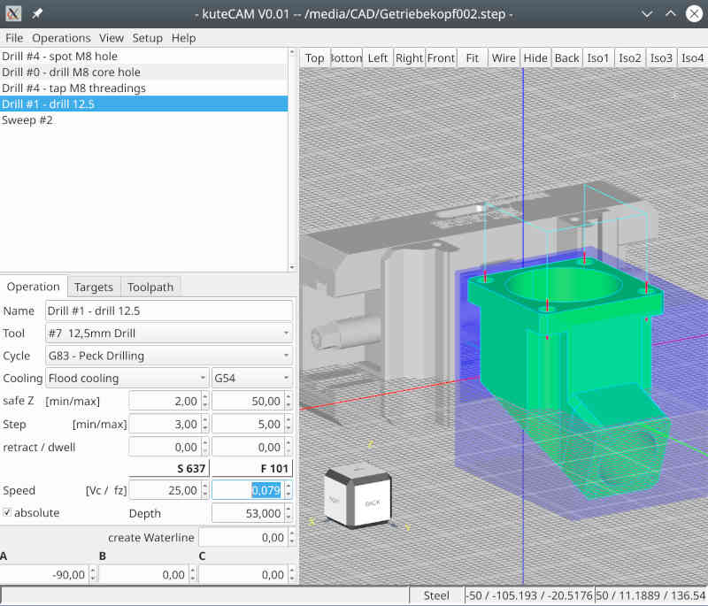

# kutecam

## Note: work in progress!
 a linux cam solution to create gcode from cad-model

### Requirements
 - Qt5
 - opencascade 7.6
 - cmake build system

## [Wiki](https://github.com/DjangoReinhard/kutecam/wiki)  contains informations about how to build and use kuteCAM

## Status
actually working:
- different kinds of selections for drill cycles
- mill a clamping plug
- mill plane faces
- mill open pockets / concave contours
- mill vertical faces

Postprocessors:
- Fanuc
- Heidenhain
- Sinumeric

## Teaser
small video clips for download
- []
- []
- []
- []

## Screenshot
- **drill holes in rotated part**

## Read more in [kuteCAM Wiki](https://github.com/DjangoReinhard/kutecam/wiki)
