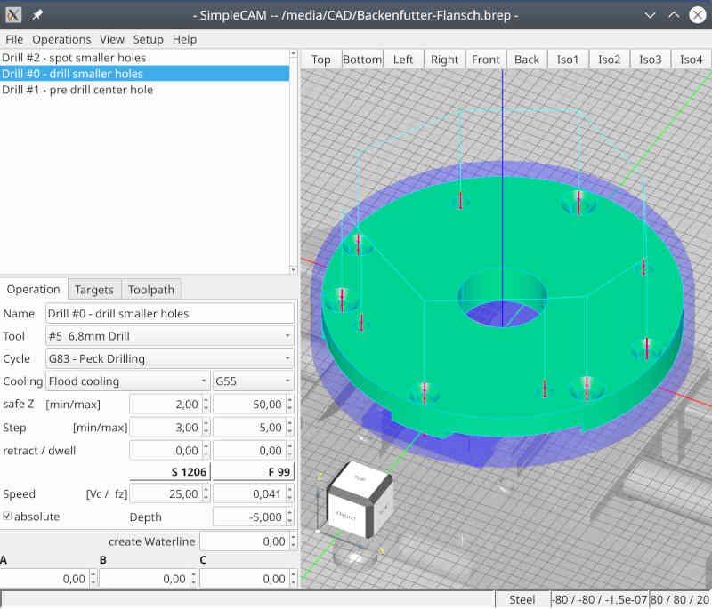

# kutecam

## Note: work in progress!
 a linux cam solution to create gcode from cad-model

### Requirements
 - Qt5
 - opencascade 7.6
 - cmake build system

## Teaser
small video clips for download
- []
- []
- []
- []

## Screenshot
[]

## first output
result of screenshot with Fanuc postprocessor

```
( Job /media/Scratch/fistTry.ngc );
( generated by kutecam );
G40 G80;
T1;
M98 P100;
;
( Drill #2 - spot smaller holes );
( T1 NC Center Drill - D:16 L:150 );
N10 G0 G90 G54 X-61.488 Y-35.500 S1000 M3 T5;
G43 H1 Z50.000 M8;
G81 Z15.750 R2.000 F99;
X-45.962 Y-45.962;
X0.000 Y-72.500;
X45.962 Y-45.962;
X61.488 Y-35.500;
X72.500 Y0.000;
X45.962 Y45.962;
X0.000 Y71.000;
X-45.962 Y45.962;
X-72.500 Y0.000;
G0 G80 G90 Z150 M5;
M9;
M98 P100;
;
( Drill #0 - drill smaller holes );
( T5 6,8mm Drill - D:6.6 L:125 );
N20 G0 G90 G55 X-61.488 Y-35.500 S1206 M3 T8;
G43 H5 Z50.000 M8;
G83 Z-5.000 R2.000 Q5 F98;
X-45.962 Y-45.962;
X0.000 Y-72.500;
X45.962 Y-45.962;
X61.488 Y-35.500;
X72.500 Y0.000;
X45.962 Y45.962;
X0.000 Y71.000;
X-45.962 Y45.962;
X-72.500 Y0.000;
G0 G80 G90 Z150 M5;
M9;
M98 P100;
;
( Drill #1 - pre drill center hole );
( T8 30mm Insert Drill - D:30 L:190 );
N30 G0 G90 G56 X0.000 Y0.000 S2122 M3 T1;
G43 H8 Z50.000 M8;
G81 Z-11.000 R2.000 F1018;
G0 G80 G90 Z150 M5;
M9;
;
G91 G28 Y0 Z0;
M30;
```
